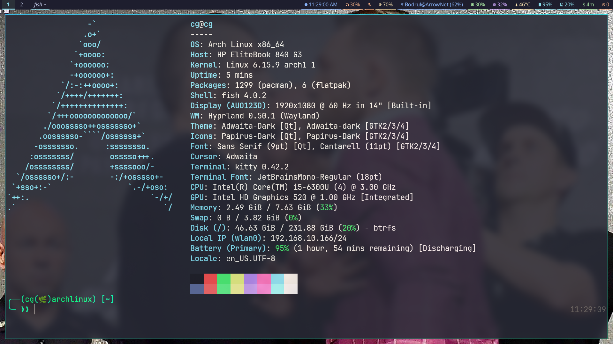

# Waybar Configuration

A clean waybar configuration for Hyprland.





## Features

**Left modules:**
- Workspaces with custom icons
- Active window title
- Weather info
- Fortune quotes

**Right modules:**
- Clock with calendar
- Audio controls (speaker + microphone)
- Brightness control
- Network status
- System monitoring (CPU, memory, temperature)
- Battery status
- Disk usage
- System uptime
- Package updates counter
- System tray

## Installation

### Clone and Setup

```bash
# Clone the repository
git clone https://github.com/Hadi493/cg-waybar.git

# Navigate to waybar config directory
cd ~/.config/waybar/

# Copy configuration files
cp -r ~/cg-waybar/* .

# Install dependencies
sudo pacman -S waybar fortune-mod

# Restart waybar
killall waybar && waybar &
```

### Alternative Installation

If you already have the files:
```bash
cp -r * ~/.config/waybar/
sudo pacman -S waybar fortune-mod
```

## Usage

### Interactive Controls

**Clock:**
- Left click: Toggle time/date format
- Calendar popup on hover

**Audio:**
- Left click: Open pavucontrol
- Right click: Mute/unmute
- Scroll: Adjust volume

**Brightness:**
- Scroll: Adjust screen brightness

**Network:**
- Left click: Open network manager (nmtui)

**System Monitoring:**
- Click CPU/Memory: Open htop
- Click Temperature: Open s-tui

**Updates:**
- Left click: Run system update

**Weather:**
- Updates every hour automatically

**Fortune Quote:**
- Left click: Show full quote in popup

### Customization

Edit `config.jsonc` for module settings and `style.css` for appearance.
